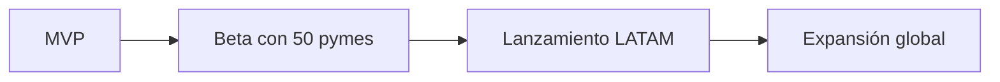

# 🚀 NovaShield

> Ciberseguridad automatizada para pymes: detecta, prioriza y corrige vulnerabilidades en minutos.


## 🎯 El problema
El 60% de las pymes que sufren un ciberataque cierra en 6 meses. No tienen equipo de seguridad ni presupuesto para uno.

## 💡 La solución
NovaShield escanea la infraestructura de una empresa, explica los riesgos en lenguaje simple y sugiere la corrección paso a paso.

## ✨ Características
- 🔍 Escaneo automático de red y servicios
- 📊 Panel con nivel de riesgo en tiempo real
- 🤖 Recomendaciones de corrección generadas con IA
- 🔔 Alertas por Slack/Discord vía webhooks

## 📈 Mercado
| Dato | Valor |
|------|-------|
| Pymes en México | 4.9 millones |
| Mercado de ciberseguridad LATAM | en crecimiento anual de dos dígitos |

## 💰 Uso de los 10 M USD
| Rubro | % |
|-------|---|
| Desarrollo de producto | 40% |
| Equipo de seguridad | 25% |
| Marketing y ventas | 25% |
| Operación legal | 10% |

## 🗺️ Roadmap


## 🛠️ Instalación
```bash
git clone https://github.com/HellCrypt/Tarea2.git
cd Tarea2
python app.py
```

## 👥 Equipo
- **Leo** · Fundador y CEO

## 📬 Contacto
tu@correo.com
